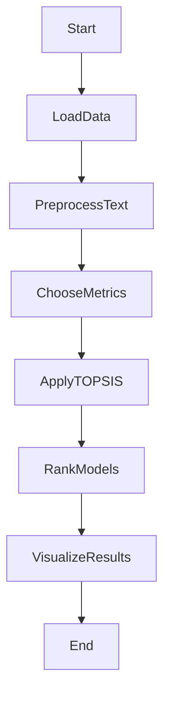

# Pre trained model comparison for text generation using topsis

```mermaid
graph TD;
  Start --> LoadData;
  LoadData --> PreprocessText;
  PreprocessText --> ChooseMetrics;
  ChooseMetrics --> ApplyTOPSIS;
  ApplyTOPSIS --> RankModels;
  RankModels --> VisualizeResults;
  VisualizeResults --> End;
```
