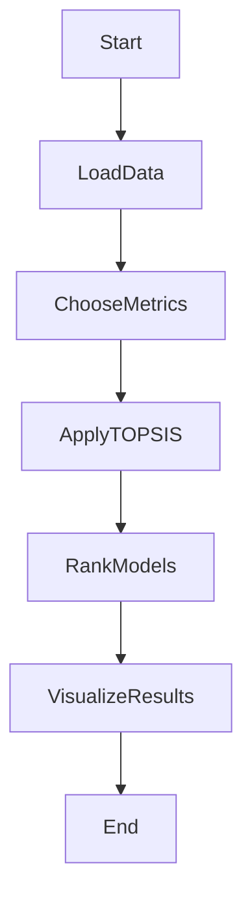
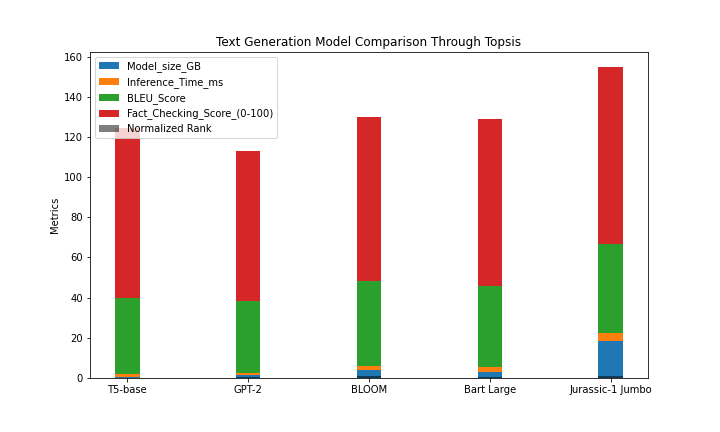

# Pre trained model comparison for text generation using topsis

## Overview
Text generation is a process where an AI system produces written content, imitating human language patterns and styles. The process involves generating coherent and meaningful text that resembles natural human communication.This project focuses on comparing the performance of various text generation models to help users choose the most suitable model for their specific needs.

## Key Features:

1. **Metrics Considered:**
   - The comparison is based on essential metrics, including BLEU scores, model size,inference time and fact checking scores.
     
2. **Methodology - TOPSIS:**
   - The Technique for Order of Preference by Similarity to Ideal Solution (TOPSIS) method is employed for the comparison. This method considers both the similarity to the ideal solution and the dissimilarity to the negative ideal solution, providing a comprehensive ranking.

3. **Models Evaluated:**
   - Real-world pretrained models, such as T5-base, GPT-2, BLOOM, Bart Large and Jurassic-1 Jumbo, are included in the comparison. These models are widely used in text generation tasks.
  
## Project Structure:

- **`data.csv`**: CSV file containing evaluation metrics for each model.
- **`result.csv`**: CSV file with ranked results in tabular format.
- **`result.csv`**: CSV file with data used for creating a bar chart.
- **`barchart.png`**: Bar chart visualizing the model comparison.

## Results and Analysis:
1. **Ranked Table:**
- Explore detailed ranked results in summarization_table_result.csv:
  
| Model            | Model_size_GB | Inference_Time_ms | BLEU_Score | Fact_Checking_Score_(0-100) | TOPSIS_Score | Rank |
| ---------------- | ------------- | ----------------- | ---------- | --------------------------- | ------------ | ---- |
| T5-base          | 0.7           | 1.5               | 37.4       | 85                          | 0.920279     | 1    |
| GPT-2            | 1.5           | 0.8               | 35.8       | 75                          | 0.458519     | 2    |
| BLOOM            | 3.9           | 2.1               | 42.1       | 82                          | 0.149159     | 4    |
| Bart Large       | 3             | 2.5               | 40.3       | 83                          | 0.202173     | 3    |
| Jurassic-1 Jumbo | 18.6          | 3.8               | 44.2       | 88                          | 0.006171     | 5    |

2. **Bar Chart:**
The bar chart visually represents the performance metrics of each model, providing an easy-to-understand comparison.

